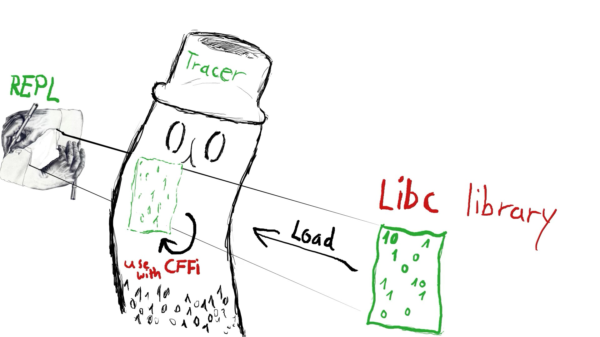
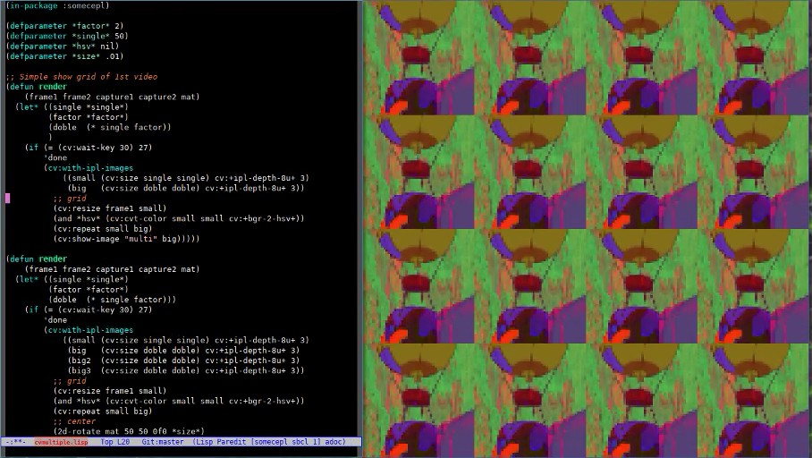

*** This was originally written to be presented at [ICLC 2019](http://iclc.livecodenetwork.org/2019/), but $$$$ ***


# Introduction

Originally conceptualized by John McCarthy on 1958. LISP, in his many faces has lived through this day. We are focusing here on Common Lisp a dialect born from the [original paper](https://www.brinckerhoff.org/clements/csc530-sp09/Readings/mccarthy-1960.pdf) that has many of the features demanded for a modern language. And, as we will see, makes a great companion for livecoding.

# Motivation

As someone with a Linux technical background and being used to compile software but little experience programming. It became annoying work in what it seemed a sandbox designed for music composition. Languages for music composition have their own IDE with a limited amount of features available. Where on any other programming language something like opening a socket would have been there from day one.

I came later to learn that sandboxes are a good thing, especially for a live-coder that has already to take care of the music.

# Common Lisp

Let's take a look at some of the more core languages features and see how we can use them for live-coding.

## REPL

A Read–Eval–Print Loop. Often referred as a "way to talk to the compiler" is a development tool that is inherently "live". We can define a function let it run within a loop. And on the middle of it, redefine it on the fly.

## CLOS - Common Lisp Object System

Common Lisp includes an object system in which methods can be overloaded. For instance we can have a method (play) that does something for an object "percussion" but a different thing for an object "wind".

This, from the point of view of the live-coder, makes things easier as one only has to think about (play) and the rest is leave to be implemented or take care offline. As an example, the method (play) below can take a list of notes (a chord) or a single note. The method can be extended to receive a symbol (like, 'C4) as the "pitch" argument and have the method look it up.

```
(defgeneric play (time pitch velocity duration channel)
  (:method ((time double-float) (pitch list) (velocity integer) (duration number) (channel integer))
    "Play chord of notes"
    (mapcar (lambda (x) (p time x velocity duration channel))
            pitch))
  (:method ((time double-float) (pitch integer) (velocity integer) (duration number) (channel integer))
    "Play given pitch"
    (at time #'fluidsynth:noteon *synth* channel pitch velocity)
    (at (+ time #[duration b]) #'fluidsynth:noteoff *synth* channel pitch)))

```

## Macros

Macros allows to change how the code is read by the compiler. It is hard separate the concept from the definition of a function. But I found it useful to put some code in between something else. Fore example, being `defbeat` a macro:
```
(defbeat kick ("x---x---" .5)
  (p time 60 60 1 0))
```
As I put (p) I could had put a function that plays a sample, a MIDI call. At the same time "x---" Is read and translated (by a old defun function) on the macro into something else.

## CFFI

C Foreign Function Interface allows languages, in this case lisp, to interact with a C library, and with a proper wrapper a C++ library. This allows to re-use any code that runs at C speed within the live coding environment of lisp. For example, we can create C pointers to different types of data including structures.



# Libraries and tools

## Common Music 2

[Common Music](http://commonmusic.sourceforge.net/) by Rick Taube was written around 91' and currently rewritten in scheme for the version 3. Provides tools for music composition, including:

- Patterns (cycle,heap,weighted random,rewrite)

- Markov analyze function

- Random functions with different distributions (odds,ran,between)
  
There is also [nudruz](https://github.com/gogins/csound-extended/tree/develop/nudruz) that extends CM2 by using the non-deterministic lisp library [screamer](https://github.com/nikodemus/screamer). In this case non-deterministic can mean, "I want a chord that follows this and that rule" where there are more than one answer to be given.

## AlsaMIDI/Fluidsynth

Fluidsynth is a program to read and play soundfonts (.sf2). This is another program we can use though cffi calls or through [AlsaMIDI](https://alsa.opensrc.org/AlsaMidi).

A fork of Tito Latini's cl-fluidsynth works stand alone is found [here](https://github.com/patterkyle/cl-fluidsynth).
A alsa midi library is at [cl-alsaseq](https://github.com/defaultxr/cl-alsaseq) 
f
Both libraries provide functions to start and to stop a midi note.

## Supercollider

Interact with supercollider to create a layer of abstraction in a different language is something done already either by languages that sit on Supercollider itself or that talk to supercollider through OSC messages in a different language. [cl-collider](https://github.com/byulparan/cl-collider) is one of this projects that allows direct interaction between common lisp and Supercollider.

We can create synths, play them and sequence them on lisp using [temporal recursion](http://extempore.moso.com.au/temporal_recursion.html).

A library that abstracts this away, in the spirit of Supercollider Patterns, is [cl-patterns](https://github.com/defaultxr/cl-patterns).

## incudine

http://incudine.sourceforge.net/
> Incudine is useful to design software synthesizers or sound plugins from scratch, exploiting the expressive power of Common Lisp, without the constraint to use pre-built unit generators.

While on supercollider the UGENs definition of what happens to the wave once it leaves the ugen lies on c++ code abstracted away by the interface the ugen provides. In incudine one can dig `slime-edit-definition` to the core definition of the ugen and understand in the same language everything else is written. For example this simple code:

```
(dsp! simple (freq amp)
  (with-samples ((in (sine freq amp 0)))
    (out in in)))
```

Can be easily read, but, if one was in doubt about (sine), jump to it's definition.

```
(define-vug sine (freq amp phase)
  "High precision sine wave oscillator with frequency FREQ, amplitude
AMP and PHASE."
  (:defaults 440 1 0)
  (* amp (sin (+ (* +twopi+ (phasor freq 0)) phase))))
```

So you can go down to phasor, %phasor, until only bare lisp constructs are at sight.

## OpenCV

Open Source Computer Vision, is one of such libraries that provides a C API we can use. A wrapper was build already by [byulparan](https://github.com/byulparan/common-cv). Meaning we have now access to the image filters and transformations provided by opencv. Or might be better the video feed of our webcam or any video file as frames. Put it along with lisp and we can live-code an image recognition software or video sequencer.



## CEPL

If we take the concept of allocating foreign memory a step further. We can in theory do the same with gpu data. In this case through OpenGL we can have lisp data converted into C data and then finally into GPU data. This is the idea behind CEPL, a opengl API for lisp that allows us to do just that.

```
(defvar *larr* (make-array 512 :element-type :float :initial-element 0))
(defvar *carr* (make-c-array *larr*)
(defvar *garr* (make-gpu-array *carr*))
(defvar *tex*  (make-texture *garr*))
(defvar *sam*  (sample *tex*))
```

Then, on the render loop, we change the values and push it again as a texture:

```
(loop :for i :upto 100 :do (setf (cepl:aref-c *c-arr* (+ (random 400) i)) (random 1f0)))
(push-g *carr* (texref *tex*))
```


Of course this is just the surface of what you can do visually with CEPL and OpenGL. The important part here is that we never stopped, I can change an improvise on the moment what and how I display something without restarts or long compilations. Is just necessary find the right abstraction that works for you.

# Work done

## CEPL integration with incudine

While both libraries can share the same lisp environment finding a way to show the changes on incudine on the screen is not as evident as defining a global variable. FFT(fast fourier transform), Wave (changes on frequency over time) and RMS (root mean square) are a couple of ways to represent that change. But the first 2 have N dimensions while the last one only 1. Uniforms, UBOs and textures make the passing of data possible: https://github.com/azimut/incudine-cepl

## Game Music Emu file read

Supercollider, and incudine fallback into using [libsndfile](http://www.mega-nerd.com/libsndfile/) which provides an interface to read different audio files. These file are read into "buffers" which are nothing more than arrays of fixed size of values.

While by default there is no support for other programs we can write little wrappers that read different types of files. Game music emu provides a library to read "game sound font" files like, sega (spc), nintendo (nsf) or atari. Which just returns an arrays of numbers too. The value of Lisp into this particular case is that each of these sound files has different "voices" that we can mute or process/filter live as we need it. A basic wrapper is at [cl-gme](https://github.com/azimut/cl-gme)

# Future work

There is work done recently integrating voice synthesis into live coding environments. From using espeak or Sinsy. Both can be wrapped similarly as done with GameMusicEmu and be ready as a audio buffer at the speed of a cffi call.

Regarding OpenCV, we can take the image frame from a video and send it to OpenGL and make similar things to recent projects like [hydra](https://github.com/ojack/hydra) are doing it now in the browser.

Incudine also offers interfaces to process external audio data, like ladspa or just fluidsynth. I need to learn more about real music production and see what can use more programming into it.

There are current pattern abstractions done by Tidal or FoxDot that reduce the singal-to-noise code ratio a lot. It should be possible re-create some of these features with an event system like [cl-patterns](https://github.com/defaultxr/cl-patterns).

# Other lispy environments

While this was focused on live-coding based on Common Lisp, there are other lisp projects out there that have some and more possibilities that the ones mentioned here.

## Music Oriented

- Extempore: Scheme - http://extemporelang.github.io/

- Common Music 3: Scheme - http://commonmusic.sourceforge.net/

- Overtone: Clojure - http://overtone.github.io/

- OpenMusic: Common Lisp - http://repmus.ircam.fr/openmusic/home

- Opusmodus: Common Lisp - http://opusmodus.com/

- Slippery Chicken: Common Lisp - http://michael-edwards.org/sc/

- Common Lisp Music - Common Lisp - https://ccrma.stanford.edu/software/clm/

## Visual Oriented

- Fluxus: Scheme - http://www.pawfal.org/fluxus/

- Quil: Clojure - http://quil.info/

- Sketch: Common Lisp - https://github.com/vydd/sketch

- Snek: Common Lisp - https://github.com/inconvergent/snek

# Conclusion

While playing around with these tools I found that the language was never the barrier to do things. Nor there was a barrier on performance or speed. Just me not understanding or just misinterpreting how an API should be used stopped me at times.

I still think that the same "live" flow on which one performs music should be the same at which one develops and extends his platform.

I ended up with a ["platform"](https://github.com/azimut/shiny) to make ["music"](https://www.youtube.com/watch?v=U_DWdn4S23w) and was able to integrated with visuals in the same language.

But, I kinda re-implemented the wheel instead making music, or learning how to make it better. Might be if you just want to make music just use one of the awesome tools already there. But if the current limits of the tools already available annoy you in some way, give Common Lisp a try.
